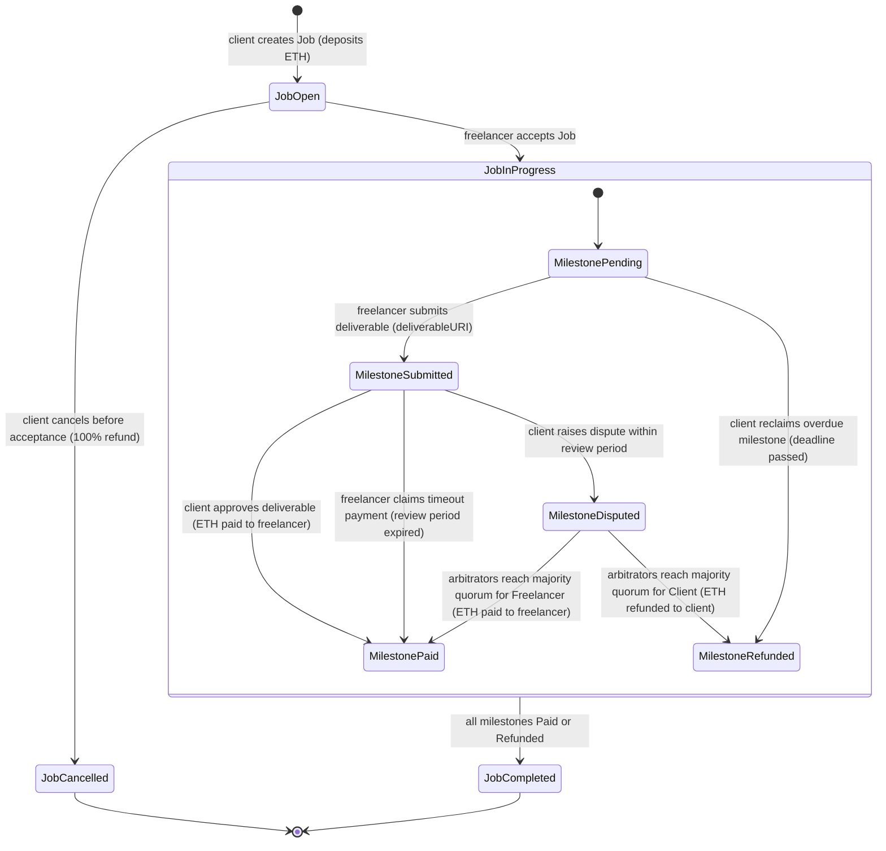
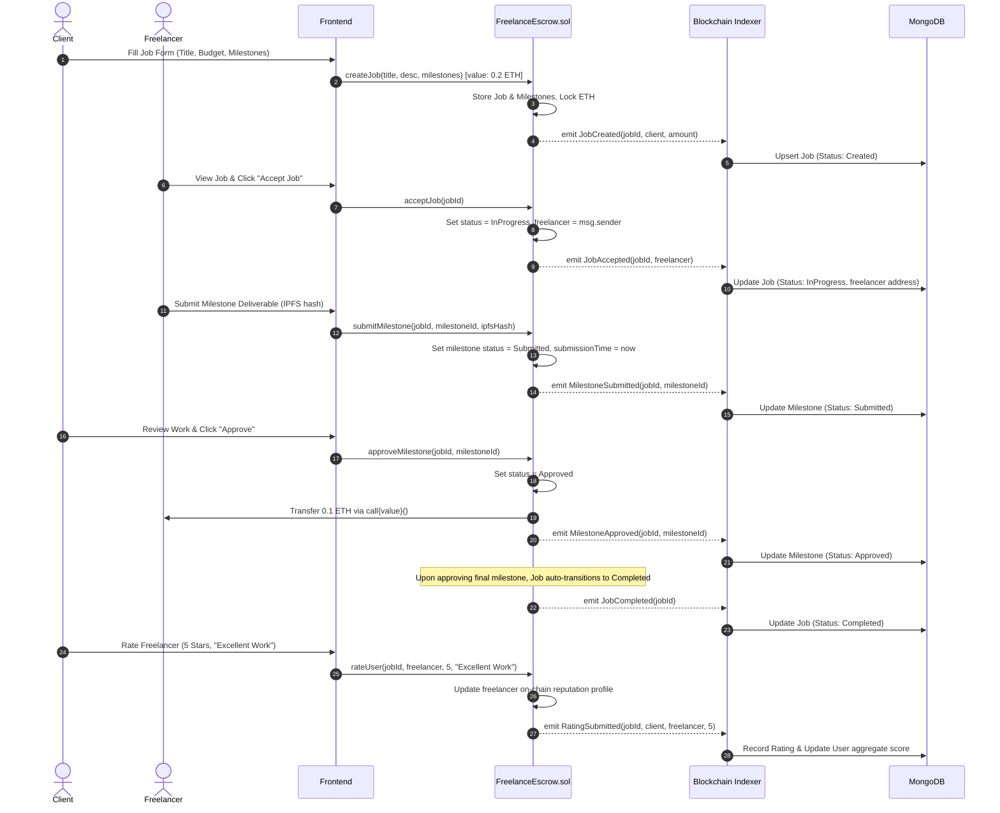
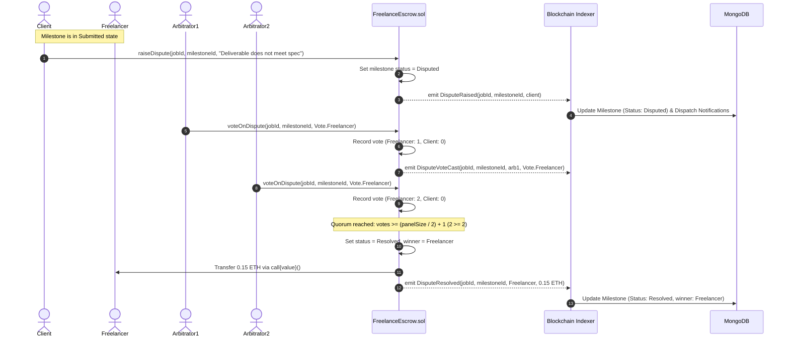
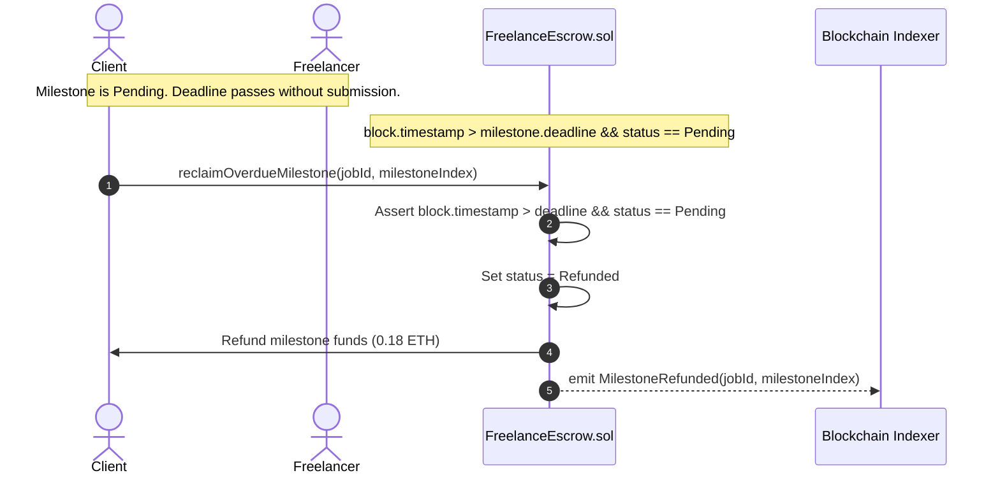
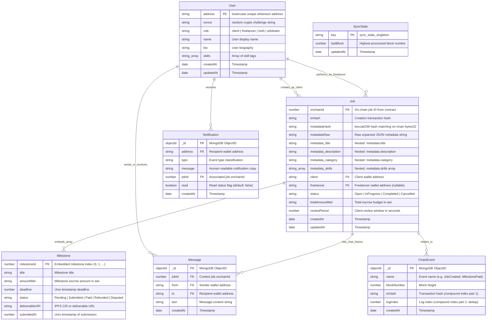

# TrustLance Architecture Specification
**VTU 7th/8th Semester Major Project (Course Code: BCS786)**  
**System Architecture, State Machines, Sequence Flows, and Data Models**

---

## 1. Executive Summary & System Architecture

TrustLance is a decentralized, milestone-based freelance marketplace and escrow protocol built on the Ethereum Virtual Machine (EVM). It eliminates intermediaries, payment delays, platform commission fees, and opaque dispute resolutions common to centralized platforms (e.g., Upwork, Fiverr) through self-executing smart contracts, cryptographic wallet authentication, and multi-arbitrator decentralized quorum resolution.

```
+---------------------------------------------------------------------------------------+
|                                    PRESENTATION TIER                                  |
|  React 18 + Vite SPA | Tailwind SaaS UI | Ethers.js v6 | Runtime /config.json Injection|
|  [Client Workspace]     [Freelancer Workspace]     [Dispute Panel]     [Public Jobs]  |
+-------------------------------------------+-------------------------------------------+
                                            |
                         +------------------+------------------+
                         |                                     |
                         v RPC (EIP-1193)                      v REST (HTTP + JWT)
+-------------------------------------------------+  +----------------------------------+
|                BLOCKCHAIN TIER                  |  |         APPLICATION TIER         |
|                                                 |  |                                  |
|  FreelanceEscrow.sol (Solidity 0.8.24)          |  |  Node.js 20 + Express 4          |
|  - Escrow Fund Custody                          |  |  - EIP-191 Nonce Challenge Auth  |
|  - Milestone State Transitions                  |  |  - Zod Input Validation          |
|  - Timeout & Overdue Automations                |  |  - Off-Chain Messaging & Ratings |
|  - Multi-Arbitrator Majority Voting             |  |  - User Metadata & Profiles      |
|  - 0% Platform Fee Pass-Through                 |  |                                  |
|                                                 |  +-----------------+----------------+
|  [Hardhat Local Node (31337) / Sepolia (11155111)]                   |
+------------------------+------------------------+                    |
                         | EVM Logs / Receipts                         |
                         v                                             v
+-------------------------------------------------+  +----------------------------------+
|              BLOCKCHAIN INDEXER                 |  |         DATA STORE TIER          |
|                                                 |  |                                  |
|  Event Ingestion Service (Ethers v6)            |  |  MongoDB 7.0 Persistent Store    |
|  - Polling Event Filter & Catch-Up Sync         |  |  - Jobs & Milestone Cache        |
|  - Idempotent logIndex Deduplication            |==>  - Transaction Event History     |
|  - Real-Time MongoDB State Projection           |  |  - User Profiles & Chat Messages |
|  - Notification Dispatcher                      |  |  - SyncState Block Cursor        |
+-------------------------------------------------+  +----------------------------------+
```

### 1.1 Layer Separation of Concerns

1. **Presentation Tier (Frontend)**:
   - Built with React 18, Vite, and modern SaaS CSS.
   - Interacts with the blockchain through `ethers.js v6` via browser wallets (MetaMask / EIP-1193 provider).
   - Reads runtime settings from [`/config.json`](file:///c:/Users/91805/Downloads/Blockchain%20project/frontend/public/config.json), completely decoupling compilation from deployment environments (12-Factor App methodology).
   - Real-time optimistic UI synchronized with on-chain states and off-chain indexed metadata.

2. **Blockchain Tier (Smart Contracts)**:
   - Solidity `0.8.24` contract [`FreelanceEscrow.sol`](file:///c:/Users/91805/Downloads/Blockchain%20project/contracts/contracts/FreelanceEscrow.sol).
   - Inherits OpenZeppelin v5 [`Ownable`](file:///c:/Users/91805/Downloads/Blockchain%20project/contracts/node_modules/@openzeppelin/contracts/access/Ownable.sol) and [`ReentrancyGuard`](file:///c:/Users/91805/Downloads/Blockchain%20project/contracts/node_modules/@openzeppelin/contracts/utils/ReentrancyGuard.sol).
   - Serves as the immutable single source of truth for funds custody, milestone completion, and dispute arbitration.
   - Enforces a 0% platform fee, routing 100% of escrow funds directly to service providers or back to clients.

3. **Application & Indexing Tier (Backend & Indexer)**:
   - Express 4 server providing REST endpoints for user authentication, off-chain communication, and notifications.
   - Authenticates users using cryptographic signatures (EIP-191 personal sign) on one-time server nonces.
   - Asynchronous blockchain indexer listening to smart contract logs with automatic replay recovery and persistent block cursor tracking (`SyncState`).
   - Idempotent upserts ensuring consistent state even during blockchain re-organizations.

4. **Data Tier (Persistence)**:
   - MongoDB 7.0 document database for structured fast query access, chat logs, user profiles, and event audit trails.
   - Hardhat local node (`http://127.0.0.1:8545`, Chain ID `31337`) for zero-cost rapid deterministic execution and Ethereum Sepolia (`Chain ID 11155111`) for public testnet deployment.

---

## 2. Smart Contract State Machine

The smart contract manages two coupled state machines: **Job Status** and **Milestone Status**.

### 2.1 State Definitions

#### Job Status (`enum JobStatus`)
- **`Open (0)`**: Job created by client; total milestone escrow funds deposited and locked in the contract.
- **`InProgress (1)`**: Freelancer accepted the job. Milestone deliverables can now be submitted.
- **`Completed (2)`**: All milestones settled (either `Paid` or `Refunded`). Escrow account balance is zero.
- **`Cancelled (3)`**: Client cancelled the job before acceptance by freelancer. 100% of deposited escrow refunded.

#### Milestone Status (`enum MilestoneStatus`)
- **`Pending (0)`**: Milestone awaiting work submission by freelancer.
- **`Submitted (1)`**: Freelancer submitted deliverable with IPFS/URI proof. Review timer initiated.
- **`Paid (2)`**: Approved by client, claimed via review timeout, or resolved in favor of freelancer by arbitrators. Escrow funds transferred to freelancer.
- **`Refunded (3)`**: Reclaimed by client after overdue deadline, or resolved in favor of client by arbitrators. Escrow funds returned to client.
- **`Disputed (4)`**: Client raised a dispute within the review period. Funds frozen pending arbitration.

### 2.2 State Transition Diagram



---

## 3. End-to-End Sequence Diagrams

### 3.1 Flow A: Happy Path Lifecycle & Dual-Sided Rating



---

### 3.2 Flow B: Milestone Dispute & Quorum Resolution



---

### 3.3 Flow C: Client Review Timeout Autonomous Payout

```mermaid
sequenceDiagram
    autonumber
    actor Freelancer
    actor Client
    participant SmartContract as FreelanceEscrow.sol
    participant Indexer as Blockchain Indexer

    Freelancer->>SmartContract: submitMilestone(jobId, milestoneIndex, ipfsHash)
    SmartContract->>SmartContract: Set submissionTime = block.timestamp
    Note over Client: Client is unresponsive for > reviewWindow (e.g. 7 days / test 3600s)
    
    Freelancer->>SmartContract: claimTimeoutPayment(jobId, milestoneIndex)
    SmartContract->>SmartContract: Assert block.timestamp >= submissionTime + reviewWindow
    SmartContract->>SmartContract: Set status = Approved
    SmartContract->>Freelancer: Transfer milestone funds (0.12 ETH)
    SmartContract-->>Indexer: emit MilestoneApproved(jobId, milestoneIndex)
    SmartContract-->>Indexer: emit TimeoutPaymentClaimed(jobId, milestoneIndex, freelancer)
```



---

### 3.4 Flow D: Overdue Milestone Escrow Refund



---

## 4. Database Schema & Entity-Relationship Model



---

## 5. Key Architectural & Gas Optimization Decisions

1. **Storage Layout & Variable Packing**:
   - Timestamps stored as `uint48` (sufficient for 8.9 million years) and enums as `uint8`, allowing multiple variables to pack within single 32-byte EVM storage slots, reducing `SSTORE` (20,000 gas) and `SLOAD` (2,100 gas) operations.

2. **Custom Errors vs. String Reverts**:
   - Replaced all `require(cond, "Long string error message")` with Solidity 0.8 custom errors (e.g., `error InvalidMilestoneAmount()`).
   - Cuts contract deployment bytecode significantly and saves ~50–300 gas on every reverted transaction by returning only a 4-byte selector rather than ABI-encoded strings.

3. **Zero Platform Fee Direct Payouts**:
   - 0% platform fee eliminates fee-splitting math, secondary treasury accounting, and reentrancy vectors associated with external fee transfers. 100% of escrowed funds flow directly to the recipient via `call{value: amount}("")`.

4. **Checks-Effects-Interactions (CEI) & Mutex**:
   - All state mutations (`milestone.status = Approved`, `job.completedMilestones++`) execute before external ETH transfers.
   - Guarded with OpenZeppelin's `nonReentrant` modifier, providing multi-layered defense-in-depth against reentrancy.

5. **Runtime `/config.json` Configuration**:
   - Standard Vite projects bake environment variables (`VITE_*`) into static bundles at build time. TrustLance uses dynamic runtime fetching of `/config.json` generated at application startup or deployment (`generate-config.js`), allowing the exact same compiled frontend bundle to serve across local Hardhat, Sepolia testnet, or Ethereum mainnet without rebuilds.
