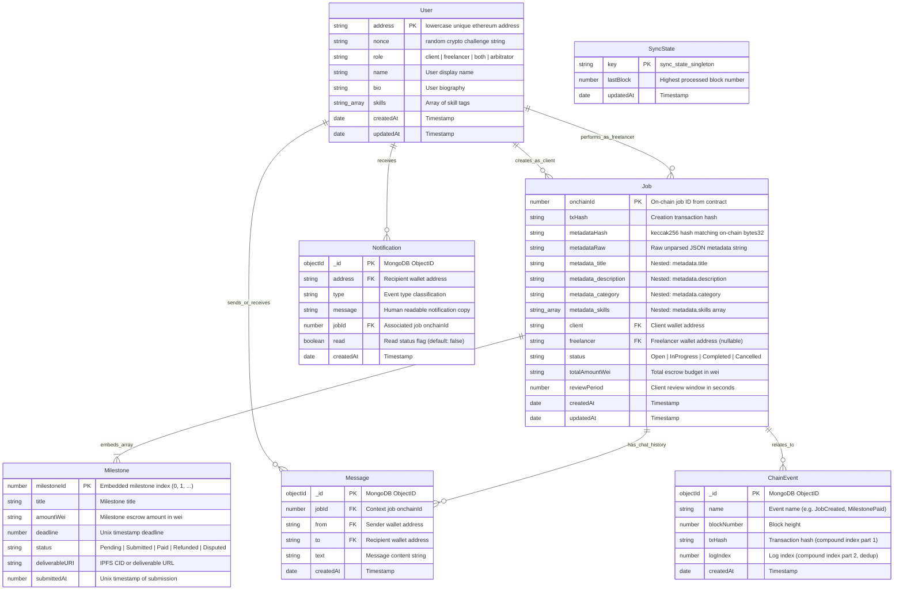

# TrustLance Database Schema Specification
**VTU 7th/8th Semester Major Project (Course Code: BCS786)**  
**MongoDB Collections, Mongoose Schemas, Indexing Strategies, and ER Model**

---

## 1. Overview & Data Layer Strategy

TrustLance utilizes MongoDB 7.0 as an off-chain operational data store. While the smart contract (`FreelanceEscrow.sol`) maintains authoritative custody and financial state, MongoDB provides:
- High-speed relational queries and full-text search for the marketplace UI.
- Off-chain direct communication channels (encrypted/plaintext job chat).
- Cryptographic challenge nonces for EIP-191 authentication.
- Blockchain event audit logs with deduplication keys.

---

## 2. Entity-Relationship (ER) Diagram

---

## 3. Detailed Collection Schemas

### 3.1 `User` Schema (`backend/src/models/User.js`)
- **`address`** (`String`, lowercase, unique index): The primary identity key derived from EIP-191 signature recovery.
- **`nonce`** (`String`, required): Cryptographically random challenge string regenerated upon each successful authentication.
- **`role`** (`String`, enum: `['client', 'freelancer', 'both', 'arbitrator']`, default: `'both'`).
- **`name`** (`String`, default: `""`): Display name.
- **`bio`** (`String`, default: `""`): Biography.
- **`skills`** (`[String]`): Array of skill tags.

### 3.2 `Job` Schema (`backend/src/models/Job.js`)
- **`onchainId`** (`Number`, unique index): Monotonically increasing job ID assigned by `FreelanceEscrow.sol`.
- **`txHash`** (`String`, required): Transaction hash of job creation.
- **`metadataHash`** (`String`, required, index): The 32-byte `keccak256` hash recorded on-chain in `createJob()`. Central to the metadata integrity protocol.
- **`metadataRaw`** (`String`): Unparsed JSON string matching `keccak256(metadataRaw) == metadataHash`.
- **`metadata`** (Subdocument):
  - **`title`** (`String`): Job title (text indexed).
  - **`description`** (`String`): Detailed scope and requirements (text indexed).
  - **`category`** (`String`): Job category (text indexed).
  - **`skills`** (`[String]`): Tags required for the position.
- **`client`** (`String`, lowercase, required, index): Wallet address of the employer.
- **`freelancer`** (`String`, lowercase, default null, index): Wallet address of the hired freelancer.
- **`status`** (`String`, enum: `['Open', 'InProgress', 'Completed', 'Cancelled']`, default: `'Open'`, index): Matches smart contract `JobStatus` enum.
- **`totalAmountWei`** (`String`, required): Total escrow amount represented in wei as a string to prevent JS 64-bit float precision loss.
- **`reviewPeriod`** (`Number`, required): Review window in seconds.
- **`milestones`** (`[milestoneSchema]`): Embedded array of milestone subdocuments (`{ _id: false }`).

### 3.3 Embedded `Milestone` Subdocument Schema
- **`milestoneId`** (`Number`, required): Milestone index (0, 1, ...).
- **`title`** (`String`, default: `""`): Milestone title.
- **`amountWei`** (`String`, required): Escrow allocation for this milestone in wei.
- **`deadline`** (`Number`, required): Unix epoch deadline.
- **`status`** (`String`, enum: `['Pending', 'Submitted', 'Paid', 'Refunded', 'Disputed']`, default: `'Pending'`).
- **`deliverableURI`** (`String`, default: `""`): IPFS CID or deliverable URL.
- **`submittedAt`** (`Number`, default: `0`): Unix timestamp when work was submitted.

### 3.4 `ChainEvent` Schema (`backend/src/models/ChainEvent.js`)
- **`txHash`** (`String`, required): Transaction hash.
- **`logIndex`** (`Number`, required): Log index within receipt.
- **`name`** (`String`, required): Event name (e.g., `JobCreated`, `MilestonePaid`).
- **`blockNumber`** (`Number`, required, index): Block height.
- **Unique Compound Index**: `{ txHash: 1, logIndex: 1 }` guarantees idempotent deduplication.

### 3.5 `Notification` Schema (`backend/src/models/Notification.js`)
- **`address`** (`String`, lowercase, required, index): Wallet address of recipient.
- **`type`** (`String`, required): Notification type code.
- **`jobId`** (`Number`, required, index): Associated job onchainId.
- **`message`** (`String`, required): Human-readable copy.
- **`read`** (`Boolean`, default: `false`): Read status flag.

### 3.6 `Message` Schema (`backend/src/models/Message.js`)
- **`jobId`** (`Number`, required, index): Associated job onchainId.
- **`from`** (`String`, lowercase, required): Sender address.
- **`to`** (`String`, lowercase, required): Recipient address.
- **`text`** (`String`, required): Chat message text.
