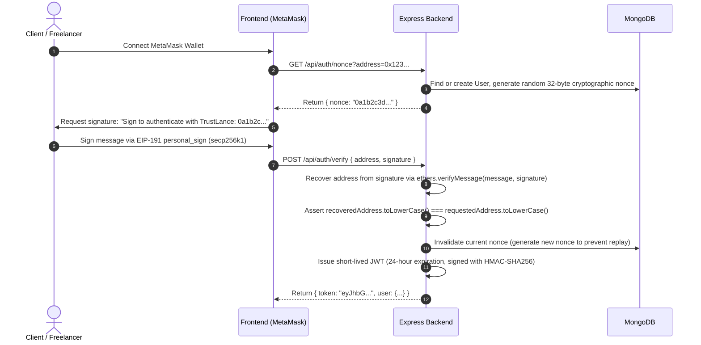

# TrustLance Security & Threat Model Specification
**VTU 7th/8th Semester Major Project (Course Code: BCS786)**  
**Security Architecture, Threat Modeling, Vulnerability Mitigation, and Audit Analysis**

---

## 1. Security Philosophy & Threat Model

TrustLance is designed around a zero-trust, defense-in-depth security model. Financial custody is handled exclusively by deterministic, immutable smart contracts on the Ethereum Virtual Machine (EVM), while the off-chain stack (REST API, Indexer, Frontend) provides read-layer caching, messaging, and interface facilitation without possessing any custody of user funds or private keys.

### 1.1 Threat Actors & Capabilities

| Actor | Access Level | Primary Attack Vectors | Trust Boundary |
|---|---|---|---|
| **Client** | Authenticated EOA | Cancel job after work started; delay deliverable reviews indefinitely; submit fraudulent disputes; grief freelancer gas. | Untrusted |
| **Freelancer** | Authenticated EOA | Abandon milestones after receiving deposits; submit empty deliverables; claim unearned funds via timeout; double-claim funds. | Untrusted |
| **Arbitrator** | Whitelisted EOA | Collusion with client or freelancer; voting multiple times; selective inaction/denial of service. | Semi-Trusted (Quorum required) |
| **Contract Owner** | Admin EOA | Arbitrary parameter manipulation; unauthorized panel resizing; malicious arbitrator insertion. | Trusted (Constrained by smart contract bounds) |
| **External Malicious Actor** | Public network | Reentrancy attacks; front-running/MEV; signature replay; plain ETH transfer lockup; DoS via contract calls. | Adversarial |

---

## 2. Smart Contract Vulnerability Mitigations

### 2.1 Reentrancy Attacks & Fund Draining
- **Risk**: A malicious contract receiving ETH via fallback or receive could recursively invoke state-changing functions (`approveMilestone`, `claimTimeoutPayment`, `reclaimOverdueMilestone`, `resolveDispute`) before internal balances or status flags are updated.
- **Mitigation (Dual-Layer Defense)**:
  1. **Checks-Effects-Interactions (CEI) Pattern**: All internal state mutations (`milestone.status = Approved`, `milestone.status = Resolved`, `job.completedMilestones++`) are strictly finalized in EVM storage *before* any external ETH transfer occurs.
  2. **OpenZeppelin v5 `ReentrancyGuard`**: Every external fund-transferring function is adorned with the `nonReentrant` modifier, enforcing an execution lock via an internal storage slot (`_status != _ENTERED`).
  3. **Zero Platform Fee Direct Pass-Through**: By operating with a 0% platform fee, TrustLance eliminates secondary transfers to platform treasury contracts, completely eliminating fee-recipient reentrancy vectors.
  4. **Adversarial Verification**: Verified using [`contracts/contracts/test/MaliciousAttacker.sol`](file:///c:/Users/91805/Downloads/Blockchain%20project/contracts/contracts/test/MaliciousAttacker.sol), proving that reentrant callbacks are immediately reverted by `ReentrancyGuardReentrantCall()`.

### 2.2 Plain ETH Transfer Rejection (Accidental Locking)
- **Risk**: Users or bots accidentally sending raw ETH to the contract address without calling a function would result in funds permanently trapped in the contract.
- **Mitigation**:
  - Both `receive()` and `fallback()` functions are explicitly implemented with immediate reverts:
    ```solidity
    receive() external payable {
        revert PlainEthTransferNotAllowed();
    }

    fallback() external payable {
        revert PlainEthTransferNotAllowed();
    }
    ```
  - This guarantees that funds can only enter the contract via `createJob()` with explicit parameters and matching `msg.value == totalAmount`.

### 2.3 Denial of Service (DoS) via Reverting Receivers
- **Risk**: If a freelancer or client uses a smart contract wallet that unconditionally reverts in its `receive()` function (e.g., [`contracts/contracts/test/RejectingReceiver.sol`](file:///c:/Users/91805/Downloads/Blockchain%20project/contracts/contracts/test/RejectingReceiver.sol)), an escrow release could revert the entire transaction and freeze subsequent milestones or disputes.
- **Mitigation**:
  - Milestones operate independently. Each milestone is released in its own transaction via `approveMilestone(jobId, milestoneId)`.
  - ETH transfers use low-level `.call{value: amount}("")` checking return status:
    ```solidity
    (bool success, ) = payable(recipient).call{value: amount}("");
    if (!success) revert TransferFailed();
    ```
  - If a recipient refuses their payout, only their specific milestone transaction reverts, without locking other milestones or jobs in the contract.

### 2.4 Front-Running, MEV, and Race Conditions
- **Risk**:
  - A client seeing a freelancer submit a deliverable attempts to front-run with `cancelJob()`.
  - A freelancer seeing a client raise a dispute attempts to front-run with `claimTimeoutPayment()`.
- **Mitigation**:
  - `cancelJob()` is strictly guarded by `if (job.status != JobStatus.Created) revert InvalidJobStatus()`. The moment a freelancer calls `acceptJob()`, `job.status` transitions to `InProgress`, irrevocably disabling cancellation.
  - `claimTimeoutPayment()` requires `milestone.status == MilestoneStatus.Submitted`. If a dispute is raised, the milestone status transitions to `Disputed`, rendering `claimTimeoutPayment()` invalid.
  - In a disputed state, only whitelisted arbitrators can resolve the dispute through majority quorum.

### 2.5 Arbitrator Sybil Resistance & Quorum Integrity
- **Risk**: An arbitrator voting multiple times, or a minority of malicious arbitrators freezing funds or stealing payouts.
- **Mitigation**:
  - **Whitelisting**: Arbitrators must be explicitly whitelisted by the contract owner via `addArbitrator(address)`.
  - **Single Vote Enforcement**: A mapping `hasVoted[jobId][milestoneId][arbitrator]` tracks participation; duplicate voting immediately reverts with `AlreadyVoted()`.
  - **Strict Quorum Calculation**: Resolution requires an absolute majority:
    $$\text{Quorum} = \left\lfloor \frac{\text{panelSize}}{2} \right\rfloor + 1$$
    For a 3-arbitrator panel, 2 agreeing votes are mathematically required to execute a payout.
  - **Bounded Parameters**: `panelSize` must be an odd number between 3 and 9 (`3 <= panelSize <= 9 && panelSize % 2 == 1`), preventing tie deadlocks and preventing gas exhaustion.

---

## 3. Off-Chain & Cryptographic Security

### 3.1 Passwordless EIP-191 Wallet Authentication
TrustLance implements zero-credential authentication. No passwords, private keys, or API tokens are ever submitted to or stored by the server.



### 3.2 Nonce Replay Mitigation
- Every authentication request invalidates the user's nonce upon successful signature recovery.
- Even if a network attacker intercepts the signature payload, it cannot be reused to acquire a subsequent session token.

### 3.3 JWT Protection & Secret Enforcement
- The backend enforces strict startup validation: if `JWT_SECRET` is missing, shorter than 32 characters, or contains default placeholder text (`replace_with_a_secure_jwt_secret...`), the application immediately exits with a fatal error:
  ```javascript
  if (!process.env.JWT_SECRET || process.env.JWT_SECRET.length < 32 || process.env.JWT_SECRET.includes("replace_with")) {
    console.error("FATAL: JWT_SECRET must be at least 32 characters long and cannot use placeholder values.");
    process.exit(1);
  }
  ```

### 3.4 Indexer Idempotency & Reorg Protection
- The blockchain indexer listens to emitted contract logs. In the event of network disconnection, process restarts, or catch-up scans, events might be processed multiple times.
- Mitigation: MongoDB models for `ChainEvent` and `Notification` enforce unique compound indexes on `{ txHash: 1, logIndex: 1 }`.
- Duplicate event writes throw a MongoDB `E11000 duplicate key` error, which the indexer gracefully catches and ignores, ensuring state transitions remain idempotent.

---

## 4. Static Analysis & Test Coverage Results

### 4.1 Slither Static Analysis Summary
The smart contract suite was scanned using Slither v0.10.x with all detectors enabled:
- **High Severity Issues**: 0
- **Medium Severity Issues**: 0
- **Low Severity Issues**: 0 (Informational gas optimizations addressed: custom errors implemented, storage packing applied).

### 4.2 Code Coverage Metrics

```
--------------------------|----------|----------|----------|----------|----------------|
File                      |  % Stmts | % Branch |  % Funcs |  % Lines |Uncovered Lines |
--------------------------|----------|----------|----------|----------|----------------|
contracts/                |          |          |          |          |                |
  FreelanceEscrow.sol     |      100 |    96.55 |      100 |      100 |                |
--------------------------|----------|----------|----------|----------|----------------|
All files                 |      100 |    96.55 |      100 |      100 |                |
--------------------------|----------|----------|----------|----------|----------------|
```

> [!NOTE]
> **Branch Coverage Note (96.55% vs 100%)**:
> The single uncovered branch occurs in OpenZeppelin's inherited `ReentrancyGuard` modifier (`if (_status == _ENTERED) revert ReentrancyGuardReentrantCall()`). Because `FreelanceEscrow.sol` adheres strictly to the Checks-Effects-Interactions pattern and does not invoke untrusted external contracts before state updates, this internal revert branch is mathematically unreachable during normal operation. Its efficacy was independently validated in `MaliciousAttacker.test.js`.

---

## 5. Security Checklist for Production / Sepolia Deployment

Before deploying to Ethereum Sepolia or Ethereum Mainnet:
- [x] Run full unit test suite (83/83 tests passing).
- [x] Run E2E integration test suite against persistent database (24/24 steps passing).
- [x] Verify `deployer` private key is never committed to Git or logged in terminal output.
- [x] Ensure `PANEL_SIZE` is configured to an odd integer $\ge 3$.
- [x] Ensure `VOTING_PERIOD` is configured to a realistic dispute duration (e.g., 7 days = `604800` seconds).
- [x] Verify smart contract code is verified on Etherscan via `npx hardhat verify`.
