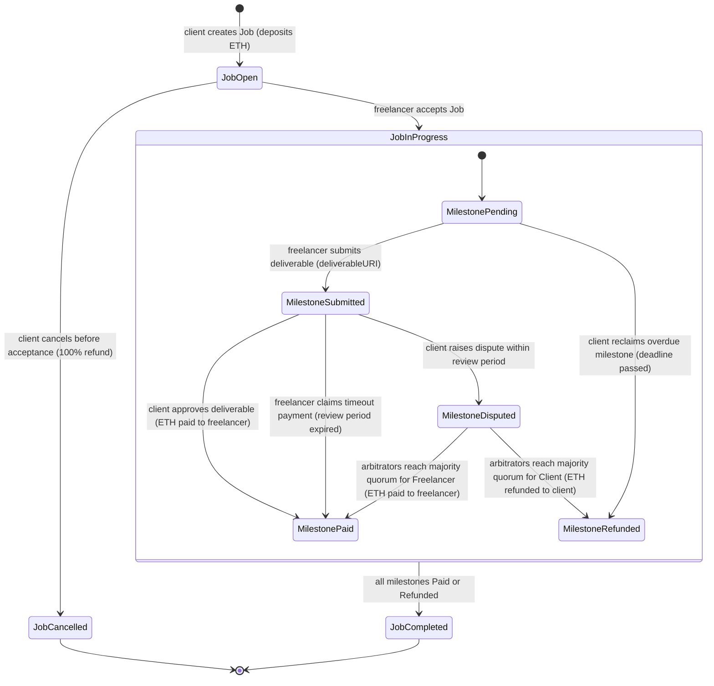

# TrustLance Smart Contract State Machine Specification
**VTU 7th/8th Semester Major Project (Course Code: BCS786)**  
**Formal State Transition Rules, Invariants, and Lifecycle Diagrams**

---

## 1. Overview of Coupled State Machines

In `FreelanceEscrow.sol`, escrow logic is governed by two coupled state machines:
1. **Job-Level State Machine (`JobStatus`)**: Represents the macro status of the contract engagement between Client and Freelancer.
2. **Milestone-Level State Machine (`MilestoneStatus`)**: Represents the granular micro status of each individual deliverable, escrow tranche, review timer, and dispute.

---

## 2. Job Status (`enum JobStatus`)

```solidity
enum JobStatus {
    Open,       // 0: Job initialized with escrowed ETH locked; awaiting freelancer acceptance
    InProgress, // 1: Accepted by freelancer; milestones can be submitted and reviewed
    Completed,  // 2: All milestones have settled (Paid or Refunded)
    Cancelled   // 3: Cancelled by client prior to acceptance; 100% deposit refunded
}
```

### Job State Transition Matrix

| Current State | Event / Function Trigger | Target State | Preconditions | Financial Effect |
|---|---|---|---|---|
| `[*] (Void)` | `createJob()` | `Open (0)` | `msg.value == sum(milestoneAmounts)`, array lengths match, deadlines valid | Locks `msg.value` in contract |
| `Open (0)` | `acceptJob()` | `InProgress (1)` | `msg.sender != job.client`, `job.status == Open` | None (Custody maintained) |
| `Open (0)` | `cancelJob()` | `Cancelled (3)` | `msg.sender == job.client`, `job.status == Open` | 100% of escrow refunded to Client |
| `InProgress (1)` | All milestones settled | `Completed (2)` | All milestones in `Paid` or `Refunded` status | Escrow balance reaches 0 |
| `InProgress (1)` | `reclaimMilestone()` | `InProgress (1)` | Milestone deadline passed without submission | Escrow tranche refunded to Client |

---

## 3. Milestone Status (`enum MilestoneStatus`)

```solidity
enum MilestoneStatus {
    Pending,   // 0: Work in progress; deliverable not yet submitted
    Submitted, // 1: Deliverable submitted; review timer active
    Paid,      // 2: Client approved, timeout claimed, or resolved for freelancer; funds paid to freelancer
    Refunded,  // 3: Milestone overdue reclaim, or resolved for client; funds refunded to client
    Disputed   // 4: Dispute raised; funds frozen pending arbitration
}
```

### Milestone State Transition Matrix

| Current State | Event / Function Trigger | Target State | Preconditions | Financial Effect |
|---|---|---|---|---|
| `Pending (0)` | `submitMilestone()` | `Submitted (1)` | `msg.sender == freelancer`, `job.status == InProgress` | None |
| `Pending (0)` | `reclaimMilestone()` | `Refunded (3)` | `msg.sender == client`, `block.timestamp > deadline` | Milestone amount refunded to Client |
| `Submitted (1)` | `approveMilestone()` | `Paid (2)` | `msg.sender == client` | Milestone amount paid to Freelancer |
| `Submitted (1)` | `claimAfterTimeout()` | `Paid (2)` | `msg.sender == freelancer`, `block.timestamp > submittedAt + reviewPeriod` | Milestone amount paid to Freelancer |
| `Submitted (1)` | `raiseDispute()` | `Disputed (4)` | `msg.sender == client`, `block.timestamp <= submittedAt + reviewPeriod` | Funds frozen in escrow |
| `Disputed (4)` | `voteOnDispute()` (Freelancer wins) | `Paid (2)` | Votes for Freelancer reach $\lfloor \text{panelSize}/2 \rfloor + 1$ | 100% paid to Freelancer |
| `Disputed (4)` | `voteOnDispute()` (Client wins) | `Refunded (3)` | Votes for Client reach $\lfloor \text{panelSize}/2 \rfloor + 1$ | 100% refunded to Client |
| `Disputed (4)` | `resolveExpiredDispute()` | `Paid (2)` or `Refunded (3)` | `block.timestamp > disputeStartedAt + votingPeriod` | Resolved by vote majority or 50/50 split |

---

## 4. Mermaid State Transition Diagram



---

## 5. Invariants Maintained Across All Transitions

1. **Exact ETH Conservation**:
   $$\text{Contract Balance} = \sum_{j \in \text{Jobs}} \sum_{m \in \text{ActiveMilestones}} \text{milestone.amount}$$
   Upon transition of all jobs to `Completed` or `Cancelled`, the contract balance is exactly 0 wei.
2. **Terminal State Immutability**:
   Once a milestone reaches `Approved`, `Resolved`, or `Refunded`, its status can never be modified again.
3. **No Double-Spending**:
   Every milestone payout or refund executes with Checks-Effects-Interactions: status update occurs before the external `.call{value}()`.
